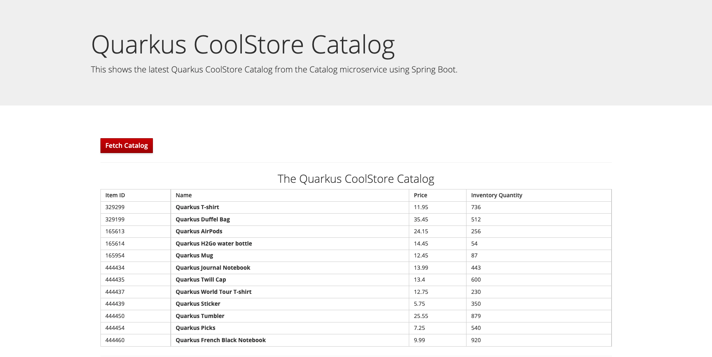

# Skupper Demo - Development Connectivity

In this tutorial you will be show you how to use skupper to connect your development laptop resources with some services exposed by Kubernetes.

## Skupper: Multicloud communication for Kubernetes

Hybrid clouds enable organizations to combine on-premise, private  cloud, and public cloud resources. While such a solution provides many benefits, it also presents a unique  challenge: enabling these resources to communicate with each other.

Skupper provides a solution to this challenge with a Virtual  Application Network that simply and securely connects applications  running in different network locations.

## Catalog and Inventory Apps

### Prerequisites

* Docker is installed and running.

  This tutorial uses Docker and the Linux container images  to run the essential local services. You should use the latest version  of Docker. For more information, see the[ Docker Engine installation documentation](https://docs.docker.com/engine/installation/).

* [skupper](https://skupper.io/start/index.html#step-1-install-the-skupper-command-line-tool-in-your-environment) command-line tool

* A Red Hat developer account with access to the [Developer Sandbox for OpenShift](https://developers.redhat.com/developer-sandbox/get-started)

## Starting the local services

To start the local services, follow these steps:

1. Clone this repository:

   ```sh
   git clone https://github.com/hguerrero/coolstore-kubecon.git
   ```

2. Change to the following directory:

   ```sh
   cd coolstore-kubecon
   ```

3. ToDo

### Try Inventory service locally

First let's run the local version of the inventory service. This applications are using the new [Quarkus development services for the database](https://quarkus.io/guides/dev-services#databases). Quarkus supports the automatic provisioning of unconfigured services in development and test mode. 

1. Change directory:

    ```sh
    cd inventory-service
    ```

2. Execute local service 

    ```sh
    mvn clean quarkus:dev
    ```

3. Open browser tab and point to http://localhost:8280

You should be able to see the inventory application running.


### Try Catalog service locally

Now, is time to test the catalog service running locally. Open a new terminal and follow the next steps:

1. Navigate to catalog folder:

   ```sh
   cd catalog-service
   ```

2. Execute local service:

   ```sh
   mvn clean quarkus:dev
   ```

3. Open a new browser tab and navigate to http://localhost:8180

You will be able to access the catalog application, and check that it is able to retrieve the inventory information from the local service:



## Deploy to OpenShift

ToDo

## Install Skupper

We will use the skupper CLI to setup a quick Skupper network. We will use the same _namespace_ where we deployed the applications.

### Install Skupper router on OpenShift

First thing is to setup the Skupper router site on the developer sandbox namespace.

1. Once you have logged in and set the current namespaces, use the `skupper status` command to check that you are in the correct namespace.

   ```sh
   skupper status
   ```

   You will see an output like this:

   ```log
   Skupper is not enabled in namespace 'username-dev'
   ```

2. Install the Skupper router in the namespace:

   ```sh
   skupper init --site-name sandbox --console-auth unsecured
   ```

   > We are calling our site `sandbox` and using an `unsecured` access to the Skupper console for demo purpose. You should enable security in any production environment.

3. The deployment should start. You can check that 2 pods are running:

   ```sh
   kubectl get pods -w
   ```

   You will get an output similar to the following:

   ```log
   ...
   skupper-router-6b5b69995c-trmgw               2/2     Running     0          7m
   skupper-service-controller-75c6cb697d-w57qk   1/1     Running     0          7m
   ```

4. Check the Skupper status:

   ```sh
   skupper status
   ```

   You will now see the site is connected:

   ```log
   Skupper is enabled for namespace "username-dev" with site name "sandbox" in interior mode. It is not linked to any other sites.
   The site console url is:  https://skupper-username-dev.someurl.com
   ```

5. Open a brower tab and access the console shown in the terminal output.

### Install Skupper Gateway on laptop

Now is time to configure the gateway to attach to the Skupper site.

1. Create a Skupper gateway as *container* type and name it *laptop*:
    ```sh
    skupper gateway init --type docker --name laptop
    ```
    > This command will start a gateway container. Stop and delete this ones as we will need to change it.

2. First, we want to expose the locall inventory service to be accessible from the OpenShift cluster as a service.
    ```sh
    skupper gateway bind inventory host.docker.internal 8280 --name laptop
    ```
    > Note: Because of the [networking restrictions on MacOS](https://docs.docker.com/desktop/mac/networking/) we will use the special DNS name `host.docker.internal` to access the service from Docker

3. No we will want to access the database service locally in the laptop so we expose it through Skupper:

    ```sh
    skupper gateway forward database 5432 --name laptop
    ```

4. Now that we have the services configured, we can proceed to export the config:

    ```sh
    skupper gateway export-config laptop . --name laptop
    ```

5. With the configuation descriptor, we can ask Skupper to create bundle for manual installation:

    ```sh
    skupper gateway generate-bundle laptop.yaml .
    ```

    > This will create a compressed file with the content necessary to run a local instance of the Skupper gateway that connects to our Skupper network.

6. Create a new folder to decompress the content.

    ```sh
    mkdir gateway
    ```

7. Untar the file

    ```sh
    tar -xvf laptop.tar.gz -C gateway
    ```

8. Change directory

    ```sh
    cd gateway
    ```

9. Make the `launch.sh` script file executable:

    ```sh
    chmod +x launch.sh
    ```

10. Becase of the default `host` [networking driver for Docker](https://docs.docker.com/network/host/) only works on Linux hosts, you will need to update the `launcher.sh` to specify the ports we want to expose locally:

    ```sh
    sed -i '' 's/--network host/--hostname ${gateway_name} -p 5432:5432 -p 55672:55672 -p 5671:5671 -p 5672:5672/' launch.sh
    ```
    > Add your locally exposed ports are required.

11. We are ready to start the local gateway:

    ```sh
    ./launch.sh -t docker
    ```

## Test access to the database

ToDo

## Test access to the local inventory service

ToDo
